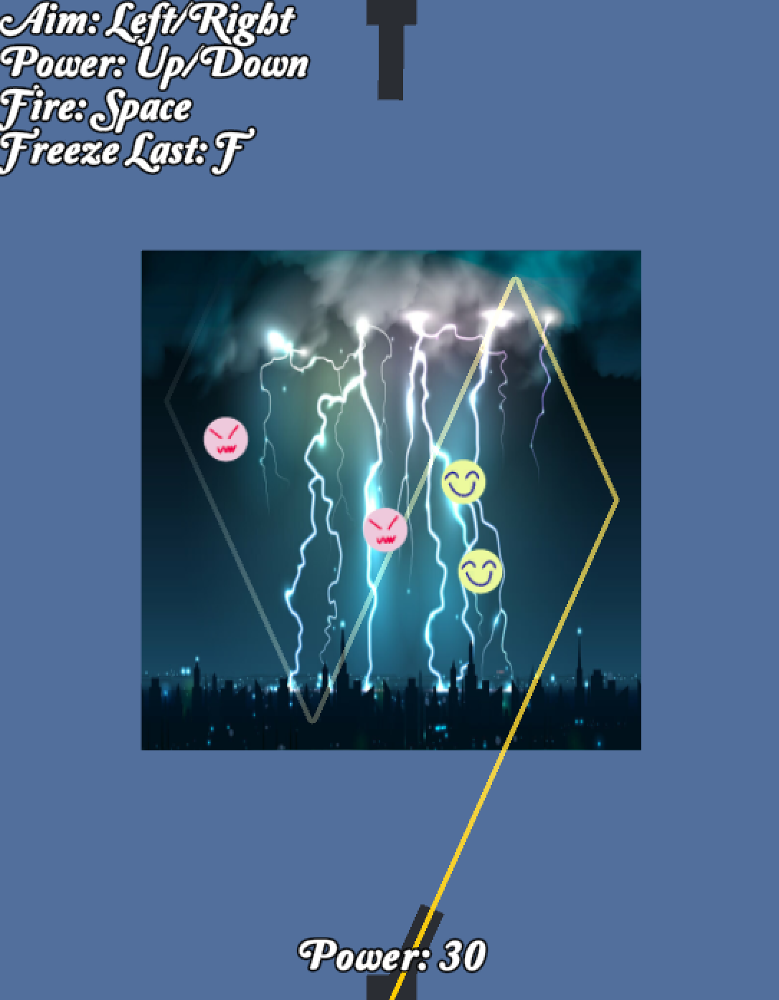

오목 인피니트 (Omok Infinite)
=====

## 개발 동기

이 게임은 일반적인 오목이 너무 싱겁거나, 너무 얌전한 게임이라고 생각하는 사람들을 위해서 만들어졌습니다.

아무리 더 멋진 개발 동기를 쓰려고 해도 이정도가 한계군요.

참고로 지금 시각은 오전 3시 28분. 을지로 사무실에서 이 글을 쓰고 있습니다. 4시까지 마무리해야되는 프로젝트이기 때문에 지금부터 슬슬 문서를 쓰기 시작한 것입니다.

## 게임 소개

플레이어는 원형 블럭을 아래에서 위로 하나씩 차례로 쏘아 올립니다. 최종적으로 5개가 일직선상에 있도록 위치시키면 승리합니다.

플레이어가 블럭을 발사할 때는 적도 동시에 블럭을 발사합니다. 적의 블럭이 먼저 일직선상에 5개가 위치한다면 플레이어의 패배입니다.

오목 인피니트의 이름은 BioShock Infinite에서 따라 해 봤는데 별 의미는 없습니다. 하하하~~~~~~~~~~~~~~

## 조작법

- 각도 조절: 좌우 방향키
- 파워 조절: 상하 방향키
- 발사: 스페이스
- 블럭 순간 정지: F키

## 블럭 순간 정지

게임이 게임답지 않아서, 이것 저것 머리를 굴리던 도중 발사한 블럭을 순간적으로 멈출 수 있게 하는 기능이 있다면 전략적으로 활용할 수 있지 않을까해서 만들어봤지만 결국 전혀 도움이 되지 않았습니다. 그래도 만들었으니까 한 번씩 써 보세요. 마지막으로 발사한 블럭에 한해서 쓸 수 있으며, 블럭당 한번만 멈춰집니다. 멈춰졌더라도 이후 외부 충격으로 다시 이동하게 됩니다. 뭐 이런 자잘한 룰이 있지만, 실제론 아무 영향도 없으니, 여기까지 읽어주셔서 감사합니다.

## 점수 산정

혹시라도 사악한 적 플레이어의 방해공작에도 굴하지 않고 어쩌다가 자기도 모르게 5개를 정렬시켰다면 우선 축하합니다! 당신은 이 치열한 전장에서 승리를 일구어내었습니다.

점수 산정 방식은 단순합니다. 만점은 2,000점으로 5개 발사해서 5개를 일직선상에 놓는 경우 얻을 수 있습니다. 이후 발사를 할 때마다 급격히 점수가 깎이게 됩니다. 개발자가 직접 테스트 해 봤을 때 마구잡이로 막 발사하면 100점대가 나오는 것으로 보입니다. 여러분은 꼭 100점보다 높은 점수를 얻길 진심으로 기원합니다.

## 개발 노트

그래도 잉야톤 행사로 개발한 프로젝트이니, 개발 과정 중 언급할만한 내용에 대해 써 봅니다.

- Physics 2D

2차원 물리 엔진을 이번에 조금 써 봤는데 역시 한 차원 줄어드니 편리하고 좋습니다.

- 단방향 Collider

Edge Collider에 Platform Effector 2D를 붙여서 쓰니까 쉽게 됐습니다. 블럭이 올라가는 공간에서 들어갈 수만 있고 튕겨나오지 않도록 하는 외벽에 사용했습니다.

- Physics Material 2D

Friction은 0, Bounciness는 1로 설정하여 완전 탄성 운동을 하도록 설정했습니다.

- 발사 가이드라인

어떤 방향으로 블럭이 발사되고, 벽에 맞아서 어떻게 튕겨나오는지 표시하는 기능을 만들어보고 싶어서 2시간 가량 써서 만들어보았습니다. Line Renderer로 쉽게 선을 그릴 수 있었고, Vector2.Reflect()란 좋은 벡터 반사 함수가 있어서(그래픽스 프로그래밍 단골 면접 문제지만) 공식이 기억나지 않아도 문제가 없더군요. 좋은 세상입니다. 유니티 만세!!!

- 판정

5개가 나란히 서 있는 것을 체크하는 것을 그냥 무식하게 했습니다. 모든 블럭에서 두 개를 선택해서(nC2) 두 블럭 사이를 광선 체크해서 총 몇 개의 블럭이 끼어들어있나 보는 방식입니다. 블럭 간 거리가 너무 먼데도 5개가 되는 경우 승리라고 보기 힘들기 때문에 이후 거리 조건도 추가했습니다. 굉장히 찝찝한 방법이지만 잘 작동하는 것 같습니다. 어차피 이 게임을 전략적으로 플레이하는 인내심 많은 사람은 없을 것이라 생각하지만, 나름 판정 결과를 색깔 변화를 시켜서 보여주기도 했습니다.

- 폰트

예쁜 것을 좀 찾아보려고 했지만 맘에 드는 걸 못찾았습니다.

- 블럭 그림 

포토샵 너무 비싸서 얼마 전 구독 취소했기 때문에 Paint.NET을 이용해서 그려봤습니다. 포토샵은 역시 위대한 것 같습니다. 하지만 다시 돈을 내지는 않으려고 합니다. 너무 비싸므로...

그림으로 사용한 것은 제가 가장 애용하는 스마일 그림입니다. 언제나 스마일은 어울리는 것 같네요.

## 마무리하며

해괴망측한 라크티의 행사 기획 탓에 한 1년만에 밤을 새 보는 것 같네요. (마지막은 아마도 외주 개발 게임의 첫 출시일이 아닐까 흐릿하게 기억합니다.) 눈이 침침하고 이제 제가 무슨 글을 쓰는지도 잘 모르겠으니 이만 줄이도록 하겠습니다. 꼭 3등 상품을 받았으면 하는 바람입니다. 라크티 보고 있나...!